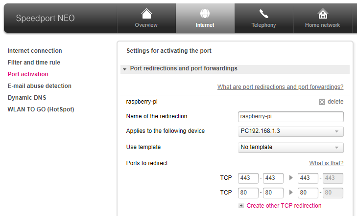

# Willkommen zum Vortrag "Build your own cloud in 30 minutes"!

Dieses Dokument ist als Begleitmaterial zu dem Hausmesse Vortrag bei der Advanced UniByte gedacht.

Es soll noch einmal genau die nötigen Schritte erklären die zum Aufbau einer eigenen NextCloud Installation auf einem kleinen PC oder RaspberryPi notwendig sind.

Dabei ist dieses Dokument als "lebendige Dokumentation" gedacht, das bedeutet wenn irgendwelche Schritte unklar sind, oder sich Fehler eingeschlichen haben, bitte nicht zögern ein Issue zu eröffnen. Auch Pull Requests sind gerne gesehen!

In diesem Sinne: Viel Spaß

## Voraussetzungen

Wir brauchen:
- Einen RaspberryPi oder (gerne auch älteren) PC/Laptop
- Ein relativ aktuelles Linux. Die Distribution ist dabei egal, wobei in diesem Dokument von einer Ubuntu-artigen Distribution ausgegangen wird. Die Kommandos zur Paket-Installation oder zum Dienste-Management müssen bei Bedarf auf die verwendete Distribution angepasst werden.
- Eine Internet-Verbindung
- Eine feste IP im LAN, am besten über Kabel (weil einfacher und meist bessere Verbindung)
- Eine DNS Domäne, z.B. von domaindiscount24.com o.ä.
- Ein Router im Heim-LAN, welcher Port-Forwarding beherrscht
- Eine (externe) Festplatte oder ausreichend großen USB Stick für die Daten

## Installation Linux

Die Installation von Linux selbst wird hier nicht weiter beschrieben. Üblicherweise genügt eine Standard-Installation, bzw. beim Raspberry Pi das Vorbereiten einer SD Karte mit dem RaspberryPi OS Image.

Eine feste IP Adresse kann man auf einem RaspberryPi über die Datei /etc/dhcpcd.conf setzen:

    pi@raspberrypi:~ $ sudo vi /etc/dhcpcd.conf
    ...
    # Example static IP configuration:
    interface eth0
    static ip_address=192.168.1.3/24
    static routers=192.168.1.1
    static domain_name_servers=192.168.1.2
    ...

Bei schwächeren Computern, wie z.B. auch dem Raspberry Pi, sollte man zusätzlich noch die grafische Oberfläche deaktivieren:

    pi@raspberrypi:~ $ sudo systemctl enable multi-user.target
    pi@raspberrypi:~ $ sudo systemctl set-default multi-user.target

Außerdem ist es für k8s empfehlenswert, Swapping zu deaktivieren. Zum einen da k8s selbst schon die verfügbaren RAM Ressourcenfür die einzelnen Pods verwaltet und limitiert, zum Anderen um die Lebensdauer der SD Karte zu erhöhen und die I/O Last auf der evtl. langsamen Festplatte zu verringern:

    pi@raspberrypi:~ $ sudo dphys-swapfile swapoff
    pi@raspberrypi:~ $ sudo dphys-swapfile uninstall
    pi@raspberrypi:~ $ sudo update-rc.d dphys-swapfile remove
    pi@raspberrypi:~ $ sudo apt-get purge -y dphys-swapfile

Auf dem RaspberryPi OS fehlen außerdem standardmäßig ein paar wichtige Einstellungen, die k3s benötigt. Um diese zu aktivieren muss die Datei /boot/cmdline.txt editiert werden, und die Zeile dort folgendermaßen angepasst werden

    console=serial0,115200 ..... cgroup_memory=1 cgroup_enable=memory

Es müssen also am Ende die zwei Parameter `cgroup_memory=1 cgroup_enable=memory` hinzugefügt werden. Ob dies bei anderen Distributionen auch vonnöten ist kann später mit dem `k3s check-config` Tool überprüft werden.

Wenn für die NextCloud-Daten eine externe Festplatte oder ein USB Stick benutzt werden soll, so muss dieser evtl. formatiert und gemountet werden. Für unser Projekt werden wir den USB Stick mit dem ext4 Dateisystem formatieren und unter `/k8s-data` einhängen:

    sudo fdisk /dev/sda
    ...
    sudo mkfs.ext4 -L k8s-data /dev/sda1

Achtung: Unbedingt darauf achten dass das richtige Device partitioniert/formatiert wird. Im Zweifelsfall hilft `lsblk` weiter.

Da wir beim Formatieren ein Label vergeben haben (`-L k8s-data`) können wir den Mount folgendermaßen persistent machen:

    pi@raspberrypi:~ $ sudo vi /etc/fstab
    ...
    LABEL=k8s-data      /k8s-data         ext4    defaults      0    0
    ...
    pi@raspberrypi:~ $ sudo mount -a

Nun sollte die Disk gemountet sein, was ein `df` bestätigen wird.

Aufgrund eines Bugs in einigen älteren Versionen des `iptables` Tools sollte dies deinstalliert werden, sofern es nicht mindestens die Version 1.8.6 hat. k3s bringt sein eigenes iptables mit und nutzt dieses, wenn im System keines installiert ist

    pi@raspberrypi:~ $ iptables --version
    iptables v1.8.2 (nf_tables)
    pi@raspberrypi:~ $ sudo apt-get remove -y iptables nftables
    pi@raspberrypi:~ $ iptables --version
    bash: iptables: command not found

Als letzten Schritt machen wir einen Reboot um sicherzustellen dass anschließend das System wieder sauber hochkommt.

    pi@raspberrypi:~ $ sudo systemctl reboot

## Einrichten des Routers

Nun konfigurieren wir den Router, so dass Anfragen aus dem Internet auf port 80 (für HTTP) und 443 (für HTTPS) an unseren RaspberryPi weitergeleitet werden. Die Umleitung von Port 80 kann später auch wieder entfernt werden, zum Testen ist diese aber sehr hilfreich.

Wie die Konfiguration auf dem Router durchgeführt werden muss ist vom Router-Modell abhängig. Im Zweifelsfall hilft hier eine Internet-Suche oder die Dokumentation weiter. Bei einem SpeedPort Neo sieht das entsprechende Menü folgendermaßen aus:

Zum Testen der Port-Weiterleitung nutzen wir einen einfachen Python Webserver in einem leeren Verzeichnis:

    pi@raspberrypi:~ $ curl -s icanhazip.com
    198.51.100.17
    pi@raspberrypi:~ $ mkdir /tmp/foo
    pi@raspberrypi:~ $ cd /tmp/foo
    pi@raspberrypi:/tmp/foo $ sudo python3 -m http.server 80
    Serving HTTP on :: port 80 (http://[::]:80/) ...

Nun sollten wir in einem Browser die Adresse `http://198.51.100.17` aufrufen können und ein leeres Verzeichnis angezeigt werden. Kommt hingegen ein Fehler oder ein Timeout, so stimmt noch etwas bei der Port-Weiterleitung nicht.

## DNS Konfigurieren

Auch hier ist es wieder stark vom Provider abhängig, wie das dynamische DNS konfiguriert wird. Üblicherweise gibt es eine GUI in der man einen Hostnamen einträgt (z.B. `cloud.au-lab.de`) und dann einen Haken setzt bei "Dynamic DNS" oder so. Der Provider sollte DNS Updates via HTTPS Anfragen unterstützen, ansonsten sind die nächsten Schritte entsprechend anzupassen.

Bei DomainDiscount24 sieht der URL zum Update der DNS Datenbank folgendermaßen aus:

    https://dynamicdns.key-systems.net/update.php?hostname=HOSTNAME&pasword=PW&ip=auto

Für `HOSTNAME` und `PW` müssen die entsprechenden Daten eingesetzt werden.

Um das DNS Update zu testen reicht ein einfacher curl Aufruf:

    pi@raspberrypi:~ curl -s https://dynamicdns.key-systems.net/update.php?hostname=cloud.au-lab.de&password=123secret456&ip=auto

Nun muss man ein paar Minuten warten, bis die DNS Updates weltweit verteilt wurden und dann sollte folgendes Kommando funktionieren:

    pi@raspberrypi:~ host cloud.au-lab.de
    cloud.au-lab.de has address 198.51.100.17

## k3s installieren

Die Installation von k3s ist denkbar einfach: auf der Homepage, https://k3s.io, ist ein Kommando aufgeführt welches man einfach in einer Shell ausführt. Dadurch wird ein Skript heruntergeladen und gestartet, welches automatisch die Distribution, CPU-Architektur und weitere Details erkennt, die passenden k3s-binaries herunterlädt und diese installiert:

    pi@raspberrypi: ~$ curl -sfL https://get.k3s.io | sudo bash -
    [INFO]  Finding release for channel stable
    [INFO]  Using v1.21.5+k3s2 as release
    [INFO]  Downloading hash https://github.com/k3s-io/k3s/releases/download/v1.21.5+k3s2/sha256sum-arm64.txt
    [INFO]  Downloading binary https://github.com/k3s-io/k3s/releases/download/v1.21.5+k3s2/k3s
    [INFO]  Verifying binary download
    [INFO]  Installing k3s to /usr/local/bin/k3s
    [INFO]  Skipping installation of SELinux RPM
    [INFO]  Creating /usr/local/bin/kubectl symlink to k3s
    [INFO]  Creating /usr/local/bin/crictl symlink to k3s
    [INFO]  Creating /usr/local/bin/ctr symlink to k3s
    [INFO]  Creating killall script /usr/local/bin/k3s-killall.sh
    [INFO]  Creating uninstall script /usr/local/bin/k3s-uninstall.sh
    [INFO]  env: Creating environment file /etc/systemd/system/k3s.service.env
    [INFO]  systemd: Creating service file /etc/systemd/system/k3s.service
    [INFO]  systemd: Enabling k3s unit
    Created symlink /etc/systemd/system/multi-user.target.wants/k3s.service → /etc/systemd/system/k3s.service.
    [INFO]  systemd: Starting k3s

Anschließend muss noch eine Anpassung durchgeführt werden, damit auch normale User das `kubectl` Tool ausführen können. Standardmäßig ist dies nur root erlaubt:

    pi@raspberrypi:~ $ echo "K3S_KUBECONFIG_MODE=0644" | sudo tee /etc/systemd/system/k3s.service.env
    K3S_KUBECONFIG_MODE=0644
    pi@raspberrypi:~ $ sudo systemctl restart k3s

Anschließend sollte sich der Cluster schon folgendermaßen melden:

    pi@raspberrypi:~ $ kubectl get nodes
    NAME            STATUS   ROLES                  AGE     VERSION
    raspberrypi     Ready    control-plane,master   6m51s   v1.21.5+k3s2

Man sollte nun auch einmal den integrierten Check durchlaufen lassen, der einen darauf hinweist falls an der Linux-Konfiguration noch etwas geändert werden muss:

    pi@raspberrypo:~$ k3s check-config
    Verifying binaries in /var/lib/rancher/k3s/data/31ff0fd447a47323a7c863dbb0a3cd4c/bin:
    ...
    System:
    - swap: disabled
    - routes: ok
    ...
    Generally Necessary:
    - cgroup hierarchy: cgroups Hybrid mounted, cpuset|memory controllers status: good
    - apparmor: enabled and tools installed
    ...
    Optional Features:
    - CONFIG_USER_NS: enabled
    - CONFIG_SECCOMP: enabled
    ...
    STATUS: pass

Falls dort rot markierte Meldungen auftauchen sollte man diese korrigieren/anpassen (Google hilft im Zweifelsfall). Gelbe Warnungen können ignoriert werden, wichtig ist dass am Ende `pass` auftaucht.

## Kubernetes Grundlagen

Folgende Begriffe tauchen in diesem Dokument immer wieder auf und werden hier kurz beschrieben:

- **Manifest:** Ein Manifest bezeichnet eine YAML Datei, welche ein oder mehrere k8s-Objekte beschreibt.
- **Namespace:** ein Namespace kapselt mehrere k8s Objekte, die logisch zusammengehören. Namespaces dienen auch der administrativen Trennung, indem man bestimmten Usern Recht auf unterschiedliche Namespaces geben kann.
- **Pod:** Ein Pod kapselt einen (oder mehrere) Container, und ist üblicherweise die kleinste Einheit eines Services mit denen sich ein k8s-Administrator beschäftigt.
- **Secret:** Secrets dienen der Trennung von Passwörtern oder API Keys, so dass diese nicht in den Beschreibungen der Pods oder Deployments selbst auftauchen. Dadurch ist zum einen eine sichere Trennung gewährleistet (ein Admin, der Pods starten und stoppen darf, benötigt nicht zwingend Berechtigungen auf den Secrets und kann somit Passwörter nicht auslesen), zum anderen können dadurch dieselben Manifest-Dateien für mehrere Umgebungen verwendet werden, ohne dass man diese extra anpassen muss.
- **Deployment:** Ein Deployment kümmert sich um Scale-Out eines bestimmten Microservices. Dazu nimmt es ein Pod-Template und erzeugt, je nach gewünschter Anzahl der Replikas, einen oder mehrere Pods und kümmert sich um deren Lifecycle. Das Deployment startet weitere Pods wenn existierende wegfallen, und entfernd Pods wenn die gewünschte Anzahl an Replicas im Cluster reduziert wird.
- **Service:** Services dienen als Einstiegspunkt beim Zugriff auf einen (in potenziell mehreren Pods verteilten) Microservice. Sie stellen einen festen Zugriffspunkt für Frontend-Services zur verfügung (über eine feste IP und/oder einen festen, cluster-internen DNS Namen) und kümmern sich um die Verteilung der Anfragen auf den jeweils besten Pod (Load-Balancing).
- **Ingress:** Ein Ingress macht einen Service außerhalb des Clusters verfügbar. Meistens geht es dabei um HTTP Dienste, bei welchen der Ingress eine ähnliche Funktion erfüllt wie ein klassischer Reverse-Proxy: Virtual Host Verwaltung, Path-Based Routing, etc.

Um mit dem k8s Cluster zu interagieren wird das Tool `kubectl` verwendet. Im Folgenden werden ein paar der häufigsten Verwendungszwecke erklärt.

    kubectl [ -n namespace] get { object }
    kubectl [ -n namespace] get { object } { identifier }
    kubectl [ -n namespace] get { object }/{ identifier }

Optional kann man noch das Ausgabeformat auswählen, indem man `-o yaml`, `-o json`  oder `-o wide` anhängt

Mit diesem Kommando werden sämtliche k8s-Objekte eines bestimmten Typs angezeigt. Beispielsweise kann man sich alle Pods im Namespace `cloud` anzeigen lassen:

    kubectl -n cloud get pods

Oder nur einen bestimmten Pod:

    kubectl -n cloud get pod mein-erster-pod
    kubectl -n cloud get pod/mein-erster-pod -o wide

Die Schreibweise mit dem Schrägstrich ist dabei die präferierte. Anstelle von `-n namespace` kann man auch `-A` oder `--all-namespaces` angeben, um die Ausgabe über sämtliche Namespaces zu erhalten. Die Parameter für den Namespace können (bzw. müssen) bei allen `kubectl` Aufrufen angegeben werden.

Eine etwas detailliertere Beschreibung der Objekte bekommtn man mittels

    kubectl describe pod/mein-erster-pod

Man kann k8s-Objekte auch über `kubectl` anlegen, bearbeiten und löschen, wobei das selten genutzt wird, da man üblicherweise über Manifest-Dateien (YAML-Dateien) mit dem Cluster interagiert (siehe weiter unten). Trotzdem sollen diese Kommandos hier kurz erwähnt werden:

    kubectl create { object } { identifier }
    kubectl delete { object }/{ identifier }
    kubectl edit { object }/{ identifier }

Wichtig, beim Löschen von Namespaces werden auch sämtliche Objekte innerhalb dieses Namespaces gelöscht!

## Cronjobs waren gestern

Zu Hause hat man meist eine dynamische IP, was bedeutet dass man eigentlich regelmäßig (z.B. jede Stunde) die IP Adresse, auf die die DNS Domäne zeigt, aktualisieren muss. Dazu hat man klassischerweise einen cronjob benutzt, den man in Linux über die Datei `/etc/crontab` (oder eine Variante davon) konfiguriert.

K8s unterstützt uns auch hierbei, so dass man nicht auf die Linux cron Konfiguration angewiesen ist. Dazu erzeugt man ein Objekt vom Typ *CronJob* (`dyndns.yaml`):

    apiVersion: batch/v1
    kind: CronJob
    metadata:
      namespace: dyndns
      name: dyndns-job
    spec:
      schedule: "13 * * * *"
      jobTemplate:
        spec:
          template:
            spec:
              containers:
              - name: cron
                image: busybox
                imagePullPolicy: IfNotPresent
                env:
                  - name: SECRET_HOSTNAME
                    valueFrom:
                      secretKeyRef:
                        name: dyndns-secret
                        key: hostname
                  - name: SECRET_PASSWORD
                    valueFrom:
                      secretKeyRef:
                        name: dyndns-secret
                        key: password
                  - name: URL
                    value: "https://dynamicdns.key-systems.net/update.php"
                command:
                - /bin/sh
                - -c
                - wget -O - "${URL}?hostname=${SECRET_HOSTNAME}&password=${SECRET_PASSWORD}&ip=auto"
              restartPolicy: OnFailure

Wir geben dem CronJob eine Schedule im standard UNIX Crontab Format mit, hier `13 * * * *`, was so viel bedeutet wie "13 Minuten nach jeder vollen Stunde". Außerdem definieren wir ein Pod-Template, welches der CronJob hernimmt um das tatsächliche Kommando auszuführen. Dazu dient hier ein BusyBox Container, dessen Standard-Kommando (eine Shell) durch einen Aufruf von `wget` ersetzt wird. Die Parameter für den Aufruf bekommen wir als Umgebungsvariable aus dem dazugehörigen Secret, welches wir folgendermaßen konfigurieren (`dyndns-secret.yaml`):

    apiVersion: v1
    kind: Secret
    metadata:
      namespace: dyndns
      name: dyndns-secret
    stringData:
      hostname: cloud.au-lab.de
      password: 1secret234!

Via `kubectl apply` spielen wir die beiden Manifest-Dateien in den Cluster ein:

    pi@raspberrypi:~ $ kubectl apply -f dyndns.yaml
    namespace/dyndns created
    cronjob.batch/dyndns-job created
    pi@raspberrypi:~ $ kubectl apply -f dyndns-secret.yaml
    secret/dyndns-secret created

Um nun nicht warten zu müssen, bis der Job das nächste mal automatisch startet, kann man ihn einmalig von Hand ausführen. Wichtig ist hier die Unterscheidung zwischen dem *CronJob*, welcher die Schedule definiert und den auszuführenden Pod, und dem *Job*, welcher einer aisgeführten Instanz eines Pods entspricht. Wir erzeugen also einen manuellen Job aus dem CronJob:

    pi@raspberrypi:~ $ kubectl -n dyndns create job --from=cronjob/dyndns-job testjob1
    job.batch/testjob1 created

Um zu überprüfen ob der Job sauber ausgeführt wurde können wir ihn mit `kubectl describe` ansehen oder mit `kubectl logs` seine Ausgaben anschauen:

    pi@raspberrypi:~$ kubectl -n dyndns-updater describe job/testjob1
    Name:           testjob1
    Namespace:      dyndns
    Selector:       controller-uid=219fa210-0e7a-4f42-926b-ddf4a73edc9e
    Labels:         controller-uid=219fa210-0e7a-4f42-926b-ddf4a73edc9e
                    job-name=testjob1
    Annotations:    cronjob.kubernetes.io/instantiate: manual
    Parallelism:    1
    Completions:    1
    Start Time:     Fri, 12 Nov 2021 16:42:55 +0100
    Completed At:   Fri, 12 Nov 2021 16:42:59 +0100
    Duration:       4s
    Pods Statuses:  0 Running / 1 Succeeded / 0 Failed
    Pod Template:
      Labels:  controller-uid=219fa210-0e7a-4f42-926b-ddf4a73edc9e
               job-name=testjob1
      Containers:
       cron:
        Image:      busybox
        Port:       <none>
        Host Port:  <none>
        Command:
          /bin/sh
          -c
          wget -O - "${URL}?hostname=${SECRET_HOSTNAME}&password=${SECRET_PASSWORD}&ip=auto"
        Environment:
          SECRET_HOSTNAME:  <set to the key 'hostname' in secret 'dyndns-secret'>  Optional: false
          SECRET_PASSWORD:  <set to the key 'password' in secret 'dyndns-secret'>  Optional: false
          URL:              https://dynamicdns.key-systems.net/update.php
        Mounts:             <none>
      Volumes:              <none>
    Events:
      Type    Reason            Age   From            Message
      ----    ------            ----  ----            -------
      Normal  SuccessfulCreate  51s   job-controller  Created pod: testjob1-dplw5
      Normal  Completed         47s   job-controller  Job completed

    pi@raspberrypi:~$ kubectl -n dyndns logs job/testjob1
    wget: note: TLS certificate validation not implemented
    [RESPONSE]
    code = 200
    description = Command completed successfully
    queuetime = 0
    runtime = 0.099
    EOF

Im Output sehen wir die Rückmeldung des API Servers unseres DNS Providers, das IP Update lief also problemlos durch.

Der Cronjob bewahrt außerdem die letzten 3 Jobs auf bevor deren Pods gelöscht werden, so dass man auch noch von älteren Jobs die Logs ansehen kann. Diese sieht man mit `kubectl get job`:

    pi@raspberrypi:~ $ kubectl get job -n dyndns
    NAME                            COMPLETIONS   DURATION   AGE
    job.batch/testjob1              1/1           4s         90m
    job.batch/dyndns-job-27278931   1/1           1s         60s
    job.batch/dyndns-job-27278893   1/1           1s         41s

# NextCloud

NextCloud besteht aus 2 Teilen, einem Frontend (Webserver, NextCloud Software, Speicherort für hochgeladene Dateien/Medien) und einem Backend (SQL Datenbank). Diese beiden Teile werden als separate Deployments innerhalb eines Namespaces ausgerollt, angefangen mit dem Backend.

## NextCloud Backend

Für die Datenbank im Backend von NextCloud verwenden wir MariaDB, und zwar in der Version 10.7, diese ist getestet und supported, und funktioniert mit NextCloud einwandfrei.

Wir nutzen also folgendes Deployment, welches dafür sorgt dass immer genau ein MariaDB Pod im Cluster läuft. Dazu dient der Parameter `replicas: 1` (`cloud_backend.yaml`):

    apiVersion: v1
    kind: Namespace
    metadata:
      name: cloud
    ---
    apiVersion: apps/v1
    kind: Deployment
    metadata:
      labels:
        app: nextcloud
        tier: backend
      name: mariadb
      namespace: cloud
    spec:
      replicas: 1
      strategy:
        type: Recreate
      selector:
        matchLabels:
          app: nextcloud
          tier: backend
      template:
        metadata:
          labels:
            app: nextcloud
            tier: backend
        spec:
          containers:
          - name: mariadb
            image: mariadb:10.7
            env:
            - name: MYSQL_DATABASE
              value: nextcloud
            - name: MYSQL_PASSWORD
              valueFrom:
                secretKeyRef:
                  name: mariadb-secret
                  key: userpassword
            - name: MYSQL_USER
              value: nextcloud
            - name: MYSQL_ROOT_PASSWORD
              valueFrom:
                secretKeyRef:
                  name: mariadb-secret
                  key: rootpassword
            ports:
            - containerPort: 3306
              name: mariadb
            volumeMounts:
            - mountPath: /var/lib/mysql
              name: mariadb-data
          restartPolicy: Always
          volumes:
          - name: mariadb-data
            hostPath:
              path: "/k8s-data/db"
              type: Directory

Das Deployment bekommt die Metadaten `app: nextcloud` sowie `tier: backend` mit, über die wir nachher die Datenbank in einem Service addressieren können.
Weiterhin geben wir dem Pod ein statisches Volume mit, welches auf unserem Host unter `/k8s-data/db` liegt; dort wird die Datenbank abgelegt, so dass sie auch einen Neustart des Pods überlebt.
Der MariaDB Pod legt beim ersten Start auch gleich einen User an, dessen Passwort holen wir aus einem Secret, welches zusätzlich auch das root-Passwort für den SQL Dienst beinhaltet. Das Secret wird später auch im Frontend genutzt, um die Verbindung über den korrekten User herzustellen. Hier ist das YAML Manifest für das Secret (`cloud_secret.yaml`):

    apiVersion: v1
    kind: Secret
    metadata:
      namespace: cloud
      name: mariadb-secret
    stringData:
      rootpassword: secret123password456
      userpassword: user1password2cloud

Nun spielen wir diese beiden Manifest Dateien in den Cluster ein und warten einen Moment, bis die Container aus dem DockerHub heruntergeladen wurden.

    pi@raspberrypi:~ $ kubectl apply -f cloud_backend.yaml
    namespace/cloud created
    deployment/mariadb created
    pi@raspberrypi:~ $ kubectl apply -f cloud_secret.yaml
    secret/mariadbsecret created
    pi@raspberrypi:~ $ ls -l /k8s-data/db | grep ^d
    drwx------ 2 999 spi      4096 Nov 20 21:56 mysql
    drwx------ 2 999 spi     12288 Nov 20 22:05 nextcloud
    drwx------ 2 999 spi      4096 Nov 20 21:56 performance_schema

Wir sehen dass (nach einigen Sekunden/Minuten) Datenbank-Dateien unter `/k8s-data/db` angelegt werden, dies zeigt, dass unsere Datenbank korrekt gestartet wurde.

Wir können uns nun auch testweise mit dem Datenbankserver verbinden, indem wir die interne IP des Pods beim Verbindungsaufbau angeben:

    pi@raspberrypi:~ $ kubectl get pod -n cloud -o wide
    NAME                       READY   STATUS    RESTARTS   AGE    IP           NODE
    mariadb-857cf4db5f-n4ng2   1/1     Running   0          4m3s   10.42.0.12   raspberrypi
    pi@raspberrypi:~ $ mysql -h 10.42.0.12 -u root -p
    Enter password: 
    Welcome to the MariaDB monitor.  Commands end with ; or \g.
    Your MariaDB connection id is 5
    Server version: 10.7.4-MariaDB-1:10.7.4+maria~focal mariadb.org binary distribution
    
    Copyright (c) 2000, 2018, Oracle, MariaDB Corporation Ab and others.
    
    Type 'help;' or '\h' for help. Type '\c' to clear the current input statement.
    
    MariaDB [(none)]> [ctrl-d]

Wenn nun allerdings der Pod stirbt, zum Beispiel durch einen Softwarefehler oder durch Ausfall des Nodes, auf dem er läuft, wird sich das Deployment automatisch darum kümmern, dass der Pod neu gestartet wird. Allerdings bekommt er dabei eine neue IP Adresse, wie wir sehr leicht nachstellen können:

    pi@raspberrypi:~ $ kubectl -n cloud delete pod mariadb-857cf4db5f-n4ng2
    pod "mariadb-857cf4db5f-n4ng2" deleted
    pi@raspberrypi:~ $ kubectl get pods -n cloud -o wide
    NAME                       READY   STATUS    RESTARTS   AGE   IP           NODE
    mariadb-857cf4db5f-l4r6s   1/1     Running   0          3s    10.42.0.13   raspberrypi

Somit bekommen wir spätestens jetzt ein Problem, wenn wir auf die Datenbank zugreifen möchten: Wie bekommt das Frontend mit, dass es sich nun auf eine andere IP connecten soll?

Dazu dienen in Kubernetes die sogenannten *Services*. Diese richten eine permanente IP ein, und sorgen dafür, dass alle Zugriffe auf diese IP an den dahinterliegenden Pod weitergereicht werden. Falls mehrere potenzielle Pods existieren sorgt der Service auch noch für ein Loadbalancing.

Folgendes YAML Manifest definiert einen Service für unsere Datenbank im Backend (`cloud_backend_service.yaml`):

    apiVersion: v1
    kind: Service
    metadata:
      name: mariadb
      namespace: cloud
      labels:
        app: nextcloud
        tier: backend
    spec:
      ports:
        - protocol: TCP
          port: 3306
      selector:
        app: nextcloud
        tier: backend

Im unteren Abschnitt, `spec`, sehen wir zum einen den TCP Port, den der Service benutzt (hier der MySQL Port 3306), sowie einen *Selector*, welcher die potenziellen Pods im Backend auswählt, an die der Traffic weitergeleitet werden soll. Hier wählen wir die Pods anhand ihrer Metadaten aus, welche den Pods oben im Deployment mitgegeben wurden.
Dadurch sind Services nicht an Deployments gebunden sondern können übergreifend auf alle Pods im Namespace zugreifen, was Applikations-Updates sehr komfortabel möglich macht.

Nachdem wir diesen Service in den Cluster einspielen können wir unsere MySQL Verbindung ständig zu der festen IP des Services aufbauen, auch wenn sich die IP der Pods dahinter ändert:

    pi@raspberrypi:~ $ kubectl apply -f cloud_backend_service.yaml
    service/mariadb created
    
    pi@raspberrypi:~ $ kubectl get all -n cloud -o wide
    NAME                           READY   STATUS    RESTARTS   AGE    IP           NODE
    pod/mariadb-857cf4db5f-l4r6s   1/1     Running   0          3m7s   10.42.0.13   raspberrypi
    
    NAME              TYPE        CLUSTER-IP     EXTERNAL-IP   PORT(S)    AGE   SELECTOR
    service/mariadb   ClusterIP   10.43.35.230   <none>        3306/TCP   10s   app=nextcloud,tier=backend
    
    NAME                      READY   UP-TO-DATE   AVAILABLE   AGE    CONTAINERS   IMAGES         SELECTOR
    deployment.apps/mariadb   1/1     1            1           7m1s   mariadb      mariadb:10.7   app=nextcloud,tier=backend
    
    pi@raspberrypi:~ $ kubectl delete pod -n cloud mariadb-857cf4db5f-l4r6s
    pod "mariadb-857cf4db5f-l4r6s" deleted
    
    pi@raspberrypi:~ $ kubectl get all -n cloud -o wide
    NAME                           READY   STATUS    RESTARTS   AGE  IP           NODE
    pod/mariadb-857cf4db5f-k2t5k   1/1     Running   0          5s   10.42.0.14   raspberrypi
    
    NAME              TYPE        CLUSTER-IP     EXTERNAL-IP   PORT(S)    AGE   SELECTOR
    service/mariadb   ClusterIP   10.43.35.230   <none>        3306/TCP   10s   app=nextcloud,tier=backend
    
    NAME                      READY   UP-TO-DATE   AVAILABLE   AGE    CONTAINERS   IMAGES         SELECTOR
    deployment.apps/mariadb   1/1     1            1           7m1s   mariadb      mariadb:10.7   app=nextcloud,tier=backend

Man sieht dass sich hier zwar die IP des Pods ändert, die feste IP des Services (10.43.35.230) aber nicht.

## NextCloud Frontend

Das Frontend ist ähnlich aufgebaut wie das Backend: Ein Deployment, welches einen einzelnen Pod mit dem korrekten NextCloud-Image verwaltet, sowie ein Service, der die HTTP Schnittstelle im Cluster verfügbar macht.

Zuerst das Manifest des Deployments, welches über diverse Umgebungsvariablen (welche auf der [Homepage](https://hub.docker.com/_/nextcloud) beschrieben sind) konfiguriert wird (`cloud_frontend.yaml`):

    apiVersion: apps/v1
    kind: Deployment
    metadata:
      labels:
        app: nextcloud
        tier: frontend
      name: nextcloud
      namespace: cloud
    spec:
      replicas: 1
      strategy:
        type: Recreate
      selector:
        matchLabels:
          app: nextcloud
          tier: frontend
      template:
        metadata:
          labels:
            app: nextcloud
            tier: frontend
        spec:
          containers:
          - env:
            - name: TZ
              value: Europe/Berlin
            - name: DEBUG
              value: "false"
            - name: NEXTCLOUD_URL
              value: https://cloud.au-lab.de
            - name: NEXTCLOUD_UPLOAD_MAX_FILESIZE
              value: 4096M
            - name: NEXTCLOUD_MAX_FILE_UPLOADS
              value: "20"
            - name: MYSQL_DATABASE
              value: nextcloud
            - name: MYSQL_HOST
              value: mariadb
            - name: MYSQL_PASSWORD
              valueFrom:
                secretKeyRef:
                  name: mariadb-secret
                  key: userpassword
            - name: MYSQL_USER
              value: nextcloud
            - name: APACHE_DISABLE_REWRITE_IP
              value: "1"
            - name: TRUSTED_PROXIES
              value: 10.0.0.0/8
            name: nc
            image: nextcloud:23
            ports:
            - containerPort: 80
              protocol: TCP
            terminationMessagePath: /dev/termination-log
            terminationMessagePolicy: File
            volumeMounts:
            - mountPath: /var/www/html
              name: nextcloud-data
          restartPolicy: Always
          volumes:
            - name: nextcloud-data
              hostPath:
                path: "/k8s-data/nextcloud"
                type: Directory

Man sieht hier, dass wir das Passwort für die Backend Datenbank aus dem gleichen Secret holen, mit dem die Datenbank ausgerollt wurde. Dadurch ist sichergestellt, dass beim Passwort kein Tippfehler passieren kann. Weiterhin wird der Host für die Datenbank auf `mariadb` gesetzt. Dieser Name ist im Cluster-internen DNS registriert, da es einen gleichnamigen Service gibt (der Service des Backends). Dadurch ist keine interne IP Adresse in der Konfiguration notwendig.

Als Datenspeicherort wird hier `/k8s-data/nextcloud` gewählt, das Verzeichnis muss bereits existieren, sonst startet der Pod nicht.

Der passende Service dazu selektiert nun den Container anhand der Metadaten `tier=frontend` sowie `app=nextcloud` (`cloud_frontend_service.yaml`):

    apiVersion: v1
    kind: Service
    metadata:
      name: nextcloud
      namespace: cloud
      labels:
        app: nextcloud
    spec:
      ports:
        - protocol: TCP
          port: 80
      selector:
        app: nextcloud
        tier: frontend

Das Einspielen der Manifests in den Cluster ist schnell getan:

    pi@raspberrypi:~ $ kubectl apply -f cloud_frontend.yaml 
    deployment.apps/nextcloud created
    pi@raspberrypi:~ $ kubectl apply -f cloud_frontend_service.yaml 
    service/nextcloud created

Man kann nun leicht prüfen, dass innerhalb des Clusters die NextCloud Webseite bereits zugreifbar ist, wenn man sie über die passende IP des Services aufruft:

    pi@raspberrypi:~ $ kubectl get all -n cloud
    NAME                            READY   STATUS    RESTARTS   AGE
    pod/mariadb-857cf4db5f-n4ng2    1/1     Running   0          36m
    pod/nextcloud-c4b779986-vfz6v   1/1     Running   0          46s

    NAME                TYPE        CLUSTER-IP     EXTERNAL-IP   PORT(S)    AGE
    service/mariadb     ClusterIP   10.43.35.230   <none>        3306/TCP   33m
    service/nextcloud   ClusterIP   10.43.145.42   <none>        80/TCP     2s

    NAME                        READY   UP-TO-DATE   AVAILABLE   AGE
    deployment.apps/mariadb     1/1     1            1           40m
    deployment.apps/nextcloud   1/1     1            1           46s

    NAME                                  DESIRED   CURRENT   READY   AGE
    replicaset.apps/mariadb-857cf4db5f    1         1         1       40m
    replicaset.apps/nextcloud-c4b779986   1         1         1       46s
    
    pi@raspberrypi: $ curl http://10.43.145.42 | head -10
    <!DOCTYPE html>
    <html class="ng-csp" data-placeholder-focus="false" lang="en" data-locale="en">
    <head data-requesttoken="ysqOjFjBOo3EShajV9Fy5w/0E=">
    <meta charset="utf-8">
    <title>Nextcloud</title>

## Der Zugang zur Außenwelt

Wir möchten das Frontend aber ja von außerhalb des Clusters zugreifbar machen. Dazu benötigen wir einen Ingress. Dieser gibt einen Service außerhalb des Clusters frei. Dafür nutzt er, je nach installierter k8s-Variante, einen bestimmten *Ingress-Controller*. Bei k3s ist dies *Traefik*.

Dieses Manifest erstellt einen Ingress für unser Frontend (`cloud_ingress.yaml`):

    apiVersion: networking.k8s.io/v1
    kind: Ingress
    metadata:
      name: cloud-ingress
      namespace: cloud
      annotations:
        kubernetes.io/ingress.class: "traefik"
    spec:
      rules:
      - host: cloud.au-lab.de
        http:
          paths:
          - path: /
            pathType: Prefix
            backend:
              service:
                name: nextcloud
                port:
                  number: 80

Ein Ingress kann mehrere Features verwenden, um über eine einzelne öffentliche IP mehrere Dienste zur Verfügung zu stellen:

* Über Virtuelle Server (SNI, Server Name Identification) kann ein Request an unterschiedliche Services weitergereicht werden, je nachdem über welchen Hostnamen der Request in den Cluster hineinkommt, selbst wenn die IP Adresse dieselbe ist. Dazu wird der HTTP Header `Host: cloud.au-lab.de` hergezogen. Deshalb muss der Hostname hier in der Konfiguration der Traefik-Regeln (*rules*) hinterlegt werden.
* Anschließend kann optional noch Path-Based Routing verwendet werden, um unterschiedliche URL-Pfade auf demselben Host auf unterschiedliche Services zu leiten, beispielsweise `http://cloud.au-lab.de/foo` auf Service A, und `http://cloud.au-lab.de/bar` auf Service B

In unserem Fall nutzen wir kein Path-Based-Routing, deshalb wird als Pfad in der Konfiguration nur `/` hinterlegt.

Wir spielen dieses YAML Manifest in den Cluster ein:

    pi@raspberrypi:~ $ kubectl apply -f cloud_ingress.yaml 
    ingress.networking.k8s.io/cloud-ingress created

Nun können wir bereits über den Hostnamen von außen auf unsere NextCloud Instanz zugreifen.

Interessant ist, dass sowohl HTTP als auch HTTPS schon funktionieren, da Traefik standardmäßig jeden Ingress nicht auch auf Port 443 publiziert, allerdings mit einem selbstsignierten Zertifikat.

Ein Zugriff über die IP Adresse ist hingegen nicht möglich, da wir dafür im Ingress keine Regel hinterlegt haben. Daher bekommen wir hier nur die Standard-Fehlerseite von Traefik angezeigt.

## Absicherung per Let's Encrypt

Als letzter Schritt fehlt nun nur noch die Absicherung der Webseite über ein gültiges TLS Zertifikat. Dieses bekommen wir kostenlos und automatisch von [Let's Encrypt](https://letsencrypt.org) ausgestellt. Da die dort erzeugten Zertifikate nur 90 Tage gültig sind und somit regelmäßig erneuert werden müssen, ist eine Automatisierung der Zertifikatsausstellung Pflicht. In Kubernetes übernimmt das ein Dienst namens [cert-manager](https://cert-manager.io/).

Die gesamte Konfiguration von cert-manager kann über ein einziges YAML Manifest im Cluster installiert werden, welches unter https://github.com/cert-manager/cert-manager/releases/download/v1.8.2/cert-manager.yaml heruntergeladen werden kann (aktuelle Version 1.8.2 zum Stand dieser Dokumentation). Man kann diese Datei entweder erst herunterladen, oder aber direkt aus dem Internet in den Cluster einspielen:

    pi@raspberrypi:~ $ kubectl apply -f https://github.com/cert-manager/cert-manager/releases/download/v1.8.2/cert-manager.yaml
    namespace/cert-manager created
    customresourcedefinition.apiextensions.k8s.io/certificaterequests.cert-manager.io created
    customresourcedefinition.apiextensions.k8s.io/certificates.cert-manager.io created
    customresourcedefinition.apiextensions.k8s.io/challenges.acme.cert-manager.io created
    ...
    deployment.apps/cert-manager-webhook created
    mutatingwebhookconfiguration.admissionregistration.k8s.io/cert-manager-webhook created
    validatingwebhookconfiguration.admissionregistration.k8s.io/cert-manager-webhook created
    pi@raspberrypi:~ $

Nach ein paar Sekunden bis Minuten sollte der Dienst einsatzbereit sein.

Um das tatsächliche Ausstellen von Zertifikaten kümmert sich im cert-manager ein sogenannter *Issuer* bzw. *ClusterIssuer*. Dieser spricht mit den API Endpunkten von Let's Encrypt, sorgt dafür dass die Challenges gelöst werden und installiert nachher die Zertifikate im Ingress.

In unserem Fall installieren wir zwei Issuer, und zwar einen für das produktive API von Let's Encrypt, und einen für das Test- bzw. Staging-API. Letzteres dient zum Testen der Zertifikats-Infrastruktur und der Automatisierungsprozesse, da das produktiv-API ein starkes Rate-Limit hat, und somit bei Tests eventuell die IP geblockt wird. Erst wenn sichergestellt ist dass die Automatisierung in Kubernetes sauber funktioniert sollte man die Zertifikate auf Produktiv-Zertifikate umstellen.

Das Manifest für die beiden Issuer (`issuer.yaml`):

    apiVersion: cert-manager.io/v1
    kind: ClusterIssuer
    metadata:
      name: letsencrypt-staging
    spec:
      acme:
        # The ACME server URL
        server: https://acme-staging-v02.api.letsencrypt.org/directory
        # Email address used for ACME registration
        email: meine.email@gmail.com
        # Name of a secret used to store the ACME account private key
        privateKeySecretRef:
          name: letsencrypt-staging-secret
        # Enable the HTTP-01 challenge provider
        solvers:
        - http01:
            ingress:
              class: traefik
    ---
    apiVersion: cert-manager.io/v1
    kind: ClusterIssuer
    metadata:
      name: letsencrypt-prod
    spec:
      acme:
        # The ACME server URL
        server: https://acme-v02.api.letsencrypt.org/directory
        # Email address used for ACME registration
        email: meine.email@gmail.com
        # Name of a secret used to store the ACME account private key
        privateKeySecretRef:
          name: letsencrypt-prod-secret
        # Enable the HTTP-01 challenge provider
        solvers:
        - http01:
            ingress:
              class: traefik

Wichtig an dieser Stelle ist, dass man eine gültige E-Mail Adresse angibt, denn Let's Encrypt wird diese Adresse verwenden um bei Bedarf Mails zu versenden, zum Beispiel wenn ein Zertifikat kurz vor dem Ablaufen ist, aber der automatische Erneuerungs-Prozess noch nicht gelaufen ist.

Nach dem Einspielen sehen wir zwei Ressourcen vom Typ "ClusterIssuer":

    pi@raspberrypi:~ $ kubectl apply -f issuer.yaml
    clusterissuer.cert-manager.io/letsencrypt-staging created
    clusterissuer.cert-manager.io/letsencrypt-prod created
    
    pi@raspberrypi:~ $ kubectl get clusterissuer
    NAME                  READY   AGE
    letsencrypt-prod      True    2m8s
    letsencrypt-staging   True    2m8s

Um nun tatsächlich Zertifikate von Let's Encrypt ausgestellt zu bekommen, müssen wir unseren Ingress leicht anpassen (`cloud_ingress_tls.yaml`):

    apiVersion: networking.k8s.io/v1
    kind: Ingress
    metadata:
      name: cloud-ingress
      namespace: cloud
      annotations:
        kubernetes.io/ingress.class: "traefik"
        cert-manager.io/cluster-issuer: letsencrypt-staging
    spec:
      rules:
      - host: cloud.au-lab.de
        http:
          paths:
          - path: /
            pathType: Prefix
            backend:
              service:
                name: nextcloud
                port:
                  number: 80
      tls:
      - hosts:
        - cloud.au-lab.de
        secretName: cloud-tls

Hier sind nur an zwei Stellen Änderungen gegenüber dem bisherigen Ingress notwendig:

* Bei den Metadaten muss eine Annotation hinzugefügt werden: `cert-manager.io/cluster-issuer: letsencrypt-staging`
* im unteren Bereich, unter `spec:` kommt nach dem Eintrag `rules:` noch der Teil ab `tls:...` hinzu

Wir benutzen hier zuerst einmal den "Staging" Issuer, um ein Test-Zertifikat zu bekommen. Nach ein paar Sekunden bis Minuten sollte ein Refresh im Browser (eventuell in einem Inkognito Tab, da manche Browser die Zertifikate relativ lange zwischenspeichern) schon ein anderes Zertifikat anzeigen. Dieses ist zwar immer noch nicht gültig (er ist ja das Test-Zertifikat), allerdings zeigt das, dass das Anfordern und Installieren von Zertifikaten einwandfrei funktioniert.

Als letzten Schritt stellen wir nun den Issuer von `letsencrypt-staging` auf `letsencrypt-prod` um. Dies kann durch einfaches Editieren der Annotation in obiger YAML Datei oder durch direktes Editieren des Ingresses mittels `kubectl -n cloud edit ingress/cloud-ingress` passieren.

Nach einer kurzen Wartezeit sollte das Zertifikat dann ein offiziell als "sicher" anerkanntes sein.

Sollte es wider Erwarten Fehler geben bei der Ausstellung der Zertifikate, so kann man sich die Kette an Kubernetes-Objekten der Reihe nach entlang hangeln (certificate -> request -> order -> challenge), um zu sehen wo das Problem liegt.

    pi@raspberrypi:~ $ kubectl get certificates
    NAME        READY   SECRET          AGE
    cloud       False   cloud-tls       21s
    
    pi@raspberrypi:~ $ kubectl describe certificate cloud
    ....
    Events:
      Type    Reason     Age   From          Message
      ----    ------     ----  ----          -------
      Normal  Issuing    34s   cert-manager  Issuing certificate as Secret does not exist
      Normal  Generated  32s   cert-manager  Stored new private key in temporary Secret resource "cloud-m72zw"
      Normal  Requested  32s   cert-manager  Created new CertificateRequest resource "cloud-b72sm"
    
    pi@raspberrypi:~ $ kubectl describe request cloud-b72sm
    ...
    Events:
      Type    Reason        Age    From          Message
      ----    ------        ----   ----          -------
      Normal  OrderCreated  8m20s  cert-manager  Created Order resource cloud-tls-b72sm-1165244518
    
    pi@raspberrypi:~ $ kubectl describe order cloud-tls-b72sm-1165244518
    ...
    Events:
      Type    Reason      Age   From          Message
      ----    ------      ----  ----          -------
      Normal  Created     72s   cert-manager  Created Challenge resource "cloud-439160286-0" for domain "cloud.au-lab.de"
    
    pi@raspberrypi:~ $ kubectl describe challenge cloud-439160286-0
    ...
    Status:
      Presented:   true
      Processing:  true
      Reason:      Waiting for http-01 challenge propagation:
                   failed to perform self check GET request 'http://cloud.au-lab.de/.well-known/acme-challenge/_fgdLz0i3TFiZW4LBjuhjgd5nTOkaMBhxYmTY':
                   Get "http://cloud.au-lab.de/.well-known/acme-challenge/_fgdLz0i3TFiZW4LBjuhjgd5nTOkaMBhxYmTY: remote error: tls: handshake failure
      State:       pending

